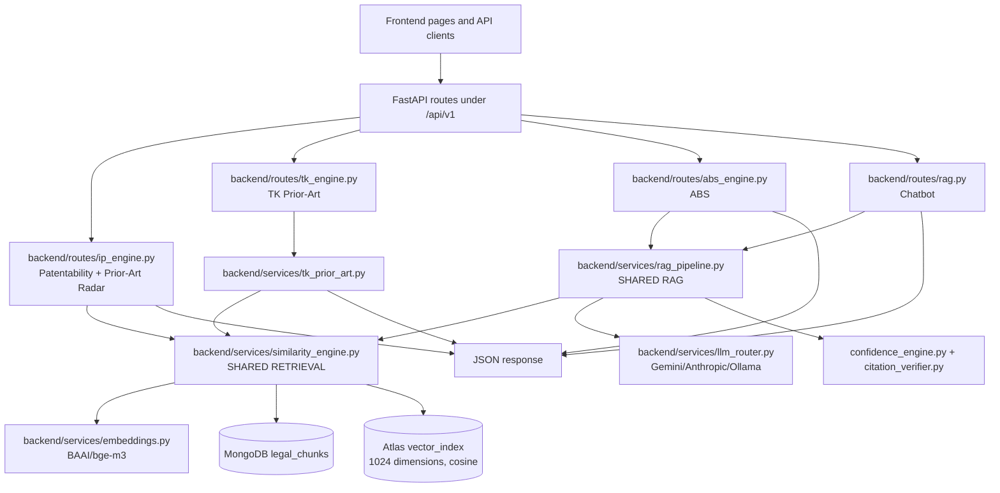

# AayuGranth Backend Feature Audit

**Scope:** Patentability Assessment, Traditional Knowledge Prior-Art, Prior-Art Radar, Access & Benefit Sharing, and Chatbot.

**Audit mode:** Read-only implementation audit. No production code, database data, or dependencies were modified during this audit.

**Repository:** `/mnt/4028129f-bea1-4830-8875-befe65c4629a/SIH`

## Executive conclusion

The five features do not share one uniform architecture. Patentability, Prior-Art Radar, and TK Prior-Art use deterministic Python route/service logic around the shared vector retrieval engine. ABS and Chatbot use the shared RAG and LLM pipeline, although ABS discards most of the generated LLM answer during post-processing. The direct TK endpoint does not call an LLM.

The shared retrieval boundary is `backend/services/similarity_engine.py::search_similar_chunks()`. It uses MongoDB `legal_chunks`, Atlas `$vectorSearch` when available, and a regex/cosine fallback when vector search fails or returns no rows. Embeddings are generated by `backend/services/embeddings.py` using `BAAI/bge-m3`, with a deterministic hash-vector fallback when model generation fails.

The most important architectural risk is source classification. Current ingestion in `backend/ingestion/ingest_corpus.py` writes `source_type="statute"` for every ingested document. Separately, the observed `classical_tk` population contains CCRAS annual reports, clinical research, and standardization material. Several features therefore rely on incomplete or heuristic source-type boundaries.

A second major risk is that similarity scores are used as evidence labels and, in the Patentability route, as inputs to legal-status-like outputs. The implementation does not perform a legally complete anticipation, inventive-step, claim-element, or jurisdiction-specific analysis.

## 1. Backend structure

The relevant backend structure is:

```text
backend/
├── main.py
├── core/
│   ├── config.py
│   └── database.py
├── models/
│   └── legal_chunk.py
├── routes/
│   ├── abs_engine.py
│   ├── ip_engine.py
│   ├── passport.py
│   ├── rag.py
│   └── novelty.py
├── services/
│   ├── citation_verifier.py
│   ├── confidence_engine.py
│   ├── embeddings.py
│   ├── intent_router.py
│   ├── llm_router.py
│   ├── out_of_scope_filter.py
│   ├── rag_pipeline.py
│   ├── similarity_engine.py
│   └── tk_prior_art.py
├── ingestion/
│   ├── ingest_corpus.py
│   └── create_vector_index.py
└── tests/
```

| File or module | Actual role | Scope |
|---|---|---|
| `backend/main.py` | Creates the FastAPI app and includes routers under `/api/v1`. | Shared infrastructure |
| `backend/core/config.py` | Loads MongoDB, embedding, LLM, timeout, and provider settings. | Shared infrastructure |
| `backend/core/database.py` | Owns the Motor MongoDB client and `get_db()`. | Shared infrastructure |
| `backend/models/legal_chunk.py` | Defines the legal-chunk data model and metadata fields. | Shared infrastructure |
| `backend/services/embeddings.py` | Loads `BAAI/bge-m3`, generates normalized vectors, and provides hash fallback. | Shared infrastructure |
| `backend/services/similarity_engine.py` | Performs Atlas vector search, keyword fallback, cosine ranking, deduplication, and relevance labels. | Shared infrastructure |
| `backend/services/rag_pipeline.py` | Routes intents, retrieves context, prompts the LLM, validates evidence IDs, and computes confidence/abstention. | Shared by ABS and Chatbot; also used by separate RAG routes |
| `backend/services/llm_router.py` | Selects Gemini, Anthropic, or local Ollama/Qwen3 according to configuration. | Shared infrastructure |
| `backend/services/confidence_engine.py` | Converts evidence and LLM metadata into confidence and abstention decisions. | Shared RAG infrastructure |
| `backend/services/citation_verifier.py` | Checks generated evidence identifiers against retrieved evidence. | Shared RAG infrastructure |
| `backend/services/intent_router.py` | Classifies the user query into RAG intents. | Chatbot/RAG |
| `backend/routes/ip_engine.py` | Implements Patentability and Prior-Art Radar. | Patentability and Radar |
| `backend/services/tk_prior_art.py` | Implements deterministic TK parsing, planning, retrieval orchestration, matching, and response construction. | TK Prior-Art |
| `backend/routes/tk_engine.py` | Thin TK API boundary around `run_tk_prior_art()`. | TK Prior-Art |
| `backend/routes/abs_engine.py` | Implements ABS screening and obligations responses. | ABS |
| `backend/routes/rag.py` | Implements Chatbot `/ask` endpoint and timeout/fallback handling. | Chatbot |
| `backend/ingestion/ingest_corpus.py` | Loads corpus documents and writes embeddings/chunks to `legal_chunks`. | Shared ingestion |
| `backend/ingestion/create_vector_index.py` | Defines the intended 1024-dimensional cosine Atlas vector index. | Shared ingestion |
| `backend/routes/passport.py` | Aggregates IP, ABS, regulatory, and TK checks for Product Passport. | Cross-feature integration |

## 2. Current architecture diagram



`similarity_engine.py`, `embeddings.py`, `database.py`, and the `legal_chunks` collection are shared components. The direct Patentability, Radar, and TK paths do not use the LLM. ABS and Chatbot use the RAG/LLM path.

## 3. Feature workflow summary

| Feature | Route | Main implementation | LLM on direct path | Primary data source |
|---|---|---|---|---|
| Patentability | `POST /api/v1/ip/patentability` | `routes/ip_engine.py::patentability()` | No | Vector/keyword retrieval plus deterministic rules |
| TK Prior-Art | `POST /api/v1/tk/check` | `routes/tk_engine.py::tk_check()` → `services/tk_prior_art.py` | No | Classical/TK-filtered `legal_chunks` |
| Prior-Art Radar | `POST /api/v1/ip/prior-art` | `routes/ip_engine.py::prior_art()` | No | Cross-domain retrieval, post-filtered for patent-looking records |
| ABS | `POST /api/v1/abs/screen` and `/obligations` | `routes/abs_engine.py` | Yes, but final answer discarded | Shared RAG retrieval plus hardcoded obligation cards |
| Chatbot | `POST /api/v1/ask/` | `routes/rag.py::ask()` → `rag_pipeline.py` | Yes | Shared RAG retrieval and LLM synthesis |

## 4. Patentability Assessment

### Route and request

The active endpoint is:

```text
POST /api/v1/ip/patentability
```

The request model is `PatentabilityRequest` in `backend/routes/ip_engine.py`:

```json
{
  "formulation_description": "string",
  "region_specific": false,
  "unique_packaging": false,
  "new_plant_variety_bred": false,
  "category": null
}
```

`formulation_description` is required by the model but has no backend non-empty or maximum-length validator. The frontend supplies a category and three boolean options.

### Actual workflow

```text
PatentabilityTool.jsx
→ frontend/src/api/ip.js::checkPatentability()
→ POST /api/v1/ip/patentability
→ backend/routes/ip_engine.py::patentability()
→ extract_formulation_intelligence()
→ similarity_engine.search_similar_chunks(formulation_description, top_k=10)
→ _is_prior_art_source() post-filter
→ deterministic similarity thresholds and category rules
→ PatentabilityResponse
→ PatentabilityTool.jsx rendering
```

The handler imports `run_rag_query`, but the direct Patentability handler does not call it. No prompt, LLM, citation verifier, or LLM post-processing runs on this route.

### Retrieval behavior

The route calls `search_similar_chunks()` without a source filter and then retains results when one of these conditions is true:

- `source_type` is `patent`, `patent_document`, `prior_art`, or `ipr`.
- A non-empty `publication_number` is available.
- The filename contains `patent` or `prior art`.

The retrieval projection does not include `publication_number`, so the publication-number branch cannot operate through the current formatted retrieval path. There is no minimum similarity cutoff after the source filter.

### Deterministic assessment

The route uses fixed score bands and input heuristics. The reported branch values include:

| Condition | Result pattern |
|---|---|
| Category is exactly `Classical Medicine` | `likely_excluded`-style result |
| Maximum similarity ≥ 0.75 | `prior_art_risk` |
| Maximum similarity ≥ 0.50 | `potentially_patentable` |
| Short text with no extracted ingredients | `insufficient_info` |
| Otherwise | `likely_patentable` |

Confidence values are branch constants rather than calibrated probabilities. The route also contains fallback classical entries with fixed scores such as `88.0`, `86.0`, and `79.0` and hardcoded citations.

### Actual response schema

`PatentabilityResponse` contains:

```json
{
  "status": "string",
  "status_label": "string",
  "confidence": "string",
  "confidence_score": 0,
  "summary": "string",
  "primary_notice": "string",
  "input_analysis": {
    "product": "string",
    "ingredients": [],
    "category": "string",
    "intended_use": "string",
    "technical_features": [],
    "traditional_references_mentioned": [],
    "why_this_matters": "string"
  },
  "criteria": [
    {
      "name": "string",
      "assessment": "string",
      "assessment_label": "string",
      "explanation": "string",
      "evidence": []
    }
  ],
  "legal_framework": [
    {
      "section": "string",
      "act": "string",
      "title": "string",
      "relevance": "string"
    }
  ],
  "prior_art": [
    {
      "title": "string",
      "source_type": "string",
      "source": "string",
      "relevance": "string",
      "similarity_score": 0,
      "excerpt": "string",
      "why_it_matters": "string",
      "url": null
    }
  ],
  "recommendations": [],
  "limitations": [],
  "posture": "string",
  "overall_posture": "string",
  "reasoning": "string",
  "why_not_patentable": "string",
  "suggestions": [],
  "ip_map": [],
  "prior_art_results": [],
  "sources": [],
  "disclaimer": "string"
}
```

The frontend renders selected fields and does not render `prior_art_results` or `sources`. It displays similarity scores as percentages. The route contains no LLM-generated fields.

### Suspicious logic

The route’s fixed similarity thresholds are used to produce patentability-like status. The implementation does not compare claim elements, test anticipation, perform an inventive-step analysis, verify citations, or apply a jurisdiction-specific legal framework. Fixed fallback evidence can appear without a successful retrieval. Entity extraction relies on limited substring lists, so unknown ingredients and technical details are ignored.

## 5. Traditional Knowledge Prior-Art

### Route and request

The active endpoint is:

```text
POST /api/v1/tk/check
```

The request model is `TKCheckRequest`:

```json
{
  "formulation_description": "string|null",
  "ingredients": ["string"],
  "source_region": "India",
  "top_k": 8
}
```

`top_k` is constrained to 1–20. `source_region` is accepted but unused by the TK engine.

### Actual workflow

```text
TKPriorArt.jsx or legacy TKOverlap.jsx
→ frontend/src/api/index.js::knowledgeApi.checkTKOverlap()
→ POST /api/v1/tk/check
→ routes/tk_engine.py::tk_check()
→ services/tk_prior_art.py::run_tk_prior_art()
→ parse_exact_input()
→ plan_searches()
→ retrieve_evidence()
→ similarity_engine.search_similar_chunks()
→ normalize_evidence()
→ match_features()
→ build_response()
→ validate_response()
→ JSON response
```

The direct TK path makes no LLM call. It uses regular-expression parsing, deterministic query planning, vector retrieval, source filtering, literal/feature matching, and deterministic assessment labels.

### TK source decision

The TK service accepts exact source types:

```text
classical_tk
classical_text
```

Legacy `classical_text` evidence is relabelled as `classical_tk` by `normalize_evidence()`. The service also excludes chunks whose document or text contains heuristic markers such as:

```text
ccras, annual report, research, clinical, study, standardization
```

This is not authoritative source classification. Existing indexed `classical_tk` data includes research and annual-report material. Current generic ingestion writes `source_type="statute"` for every inserted document, so the observed classical/TK population appears to have originated through a separate or legacy ingestion path.

### Parser and planner behavior

The parser preserves `raw_input` and extracts ingredients, forms, proportions, preparation, intended use, processing, extraction, delivery, synthetic modification, and other features. The implementation previously failed for direct plus-separated input, such as:

```text
Withania somnifera root + Tinospora cordifolia stem
```

The controlled `containing` format is recognized. Short intended-use wording such as `used for fever and digestive weakness` is not consistently recognized; the parser is stronger for `traditionally used for ...` wording.

The planner creates individual ingredient, combination, proportion, indication, preparation, and combined-formulation queries. Each planned query is searched independently for both `classical_tk` and legacy `classical_text`.

### Retrieval behavior

`search_similar_chunks()` uses Atlas vector search with an exact source-type filter when one is supplied. If vector search fails or returns no rows, it uses regex candidate retrieval and in-memory cosine similarity. TK retrieval has no minimum score cutoff. It applies heuristic research-marker exclusion after retrieval. Page metadata is not projected by the shared retrieval formatter, so citations frequently fall back to `Source citation unavailable in indexed metadata.`

### Matching and response

Matching distinguishes individual ingredient evidence from combination evidence. A combination is not established merely because two ingredients occur in separate passages. Exact formulation status requires support across formulation features. The status values include:

```text
EXACT / NEAR-EXACT
STRONG
PARTIAL
NOT ESTABLISHED
```

The service does not issue a legal novelty or patentability conclusion.

### Actual TK response schema

The endpoint returns an untyped dictionary with these top-level fields:

```json
{
  "status": "overlap_established|not_established",
  "status_label": "string",
  "overlap_level": "string",
  "assessment": "string",
  "formulation_under_review": {
    "raw_input": "string",
    "ingredients": [],
    "ingredient_forms": [],
    "proportions": [],
    "preparation_method": "string",
    "dosage_form": "string",
    "intended_use": "string",
    "extraction_method": "string",
    "delivery_technology": "string",
    "processing": "string",
    "synthetic_modification": "string",
    "other_features": []
  },
  "ingredient_evidence": [],
  "combination_evidence": {},
  "preparation_evidence": {},
  "intended_use_evidence": {},
  "exact_formulation_match": {},
  "evidence_matrix": [],
  "evidence": [],
  "potential_ip_significance": {},
  "limitations": [],
  "disclaimer": "Information, not legal advice",
  "overlap_detected": false,
  "has_tk_overlap": false,
  "max_similarity": 0,
  "sources": [],
  "summary": "string",
  "primary_notice": "string",
  "classical_references": []
}
```

Evidence records contain `source_type`, `document_title`, `document_id`, `page`, `section`, `text`, `similarity_score`, and `evidence_role`. Match records contain `feature`, `user_value`, `evidence_value`, `status`, `source`, `citation`, and `reason`. `classical_references` is hardcoded to an empty array in the rebuilt service.

### Frontend and integration observations

`TKPriorArt.jsx` consumes the rebuilt evidence-oriented schema. The legacy `TKOverlap.jsx` expects `overlap_detected`, `summary`, and classical references with fields such as text name, chapter, verse, and translation. The current direct endpoint does not populate those legacy classical references.

Product Passport calls a reduced TK engine result. Its status adapter expects `High` and `Moderate`, while the rebuilt service returns labels such as `STRONG`, `PARTIAL`, and `EXACT / NEAR-EXACT`. This is a compatibility mismatch. The public Passport page also retains substantial hardcoded/default TK content.

## 6. Prior-Art Radar / Similarity Radar

### Route and request

The active endpoint is:

```text
POST /api/v1/ip/prior-art
```

The request model is:

```json
{
  "formulation_description": "string",
  "top_k": 10
}
```

`top_k` is constrained to 1–50. No source type, jurisdiction, legal domain, or document-status filter is exposed.

### Actual workflow

```text
PriorArtRadar.jsx
→ frontend/src/api/ip.js::checkPriorArt()
→ POST /api/v1/ip/prior-art
→ routes/ip_engine.py::prior_art()
→ similarity_engine.search_similar_chunks(query, top_k)
→ _is_prior_art_source() post-filter
→ max similarity and relevance label calculation
→ PriorArtResponse
→ PriorArtRadar.jsx
```

No LLM, RAG prompt, claim analysis, or case-law reasoning runs on this route.

### Source distinction

The Radar does not apply an Atlas source filter. It retrieves across the corpus and then post-filters results through `_is_prior_art_source()`. A result passes when its source type resembles a patent category, when publication metadata is present, or when the filename contains `patent` or `prior art`.

The implementation does not reliably distinguish patent, case law, classical TK, statute, regulatory guidance, and unknown through a complete typed classification. Filename substring checks can misclassify a statute document with `patent` in its name.

### Actual response schema

```json
{
  "query": "string",
  "results": [
    {
      "chunk_id": "string",
      "chunk_text": "string",
      "source_document": "string",
      "law_type": "string",
      "section": "string|null",
      "semantic_similarity": 0,
      "prior_art_relevance": "High|Moderate|Low"
    }
  ],
  "disclaimer": "This is a preliminary assessment for informational purposes only — not legal advice. Consult a qualified IP/regulatory professional.",
  "max_similarity": 0,
  "overall_relevance": "High|Moderate|Low"
}
```

`overall_relevance` is `High` at 0.75 or above, `Moderate` above 0.50, and `Low` otherwise. A zero-result search returns `max_similarity: 0` and `Low`; that label does not prove that no prior art exists.

### Suspicious logic

The route filters after top-k retrieval, so relevant qualifying records outside the initial top-k cannot be recovered. There is no minimum score cutoff after filtering. `publication_number` is relied upon by the source predicate but is omitted by the retrieval projection. The frontend displays similarity as a percentage and does not render source type, jurisdiction, or publication metadata.

The adjacent legacy `/novelty/check` path is separate and schema-inconsistent: `frontend/src/pages/ip/Novelty.jsx` expects `closest_prior_art` and `suggestions`, while `backend/routes/novelty.py` returns `closest_match` and `suggestion`.

## 7. Access & Benefit Sharing

### Routes and requests

The active routes are:

```text
POST /api/v1/abs/screen
POST /api/v1/abs/obligations
```

The request models are:

```json
{
  "ingredients": ["string"],
  "source_region": "string",
  "is_biological": true
}
```

and:

```json
{
  "ingredients": ["string"],
  "source_region": "string",
  "category": "string|null"
}
```

The repository documentation describes a `product_id` contract, but the actual route accepts ingredients and source region. `category` is declared but unused.

### Actual workflow

```text
ABSPage.jsx
→ frontend/src/api/index.js::screenABS()
→ POST /api/v1/abs/screen
→ routes/abs_engine.py::abs_screen()
→ hardcoded region and biological checks
→ _get_obligations_data()
→ rag_pipeline.run_rag_query()
→ similarity_engine.search_similar_chunks(top_k=6)
→ LLM JSON synthesis and confidence metadata
→ hardcoded five obligation cards and summary
→ ABSScreenResponse
→ ABSPage.jsx
```

`/abs/obligations` invokes the same helper but has a different applicability rule: it computes applicability from region and ignores `is_biological`.

### Applicability logic

`abs_screen()` lowercases the region and checks for substring matches against a hardcoded set including India, Brazil, South Africa, Kenya, Malaysia, Indonesia, Peru, Colombia, Costa Rica, Philippines, Thailand, Vietnam, China, Mexico, and Ethiopia. It then computes:

```text
applicable = is_biological AND region_triggers_abs
```

Ingredient identity is not used for the applicability decision. It is only included in the RAG query.

### RAG and LLM behavior

The helper creates an ABS-oriented query focused on the Biological Diversity Act, NBA/SBB, approvals, benefit sharing, disclosure, and documentation. It calls `run_rag_query(query, jurisdiction="India")`.

The RAG pipeline retrieves six shared chunks without an ABS source filter. It prompts the configured RAG LLM with evidence blocks and requires structured assessment, jurisdiction, confidence, key findings, evidence IDs, and an insufficiency flag. Citation verification checks evidence IDs against the retrieved map, not claim entailment.

`abs_engine.py` assigns the LLM final answer to a local variable named `rag_answer` but does not use it in the final response. The returned assessment cards and summary are hardcoded. Confidence, source IDs, and escalation metadata survive.

### Actual response schema

```json
{
  "applicable": true,
  "reasoning": "string",
  "color": "string",
  "region_triggers_abs": true,
  "is_biological": true,
  "disclaimer": "Preliminary assessment only — not legal advice.",
  "obligations": [
    {
      "area": "Competent Authority|Approval / Intimation|Benefit-Sharing|IPR / Disclosure|Required Documentation",
      "status": "REVIEW REQUIRED",
      "color": "yellow",
      "what_this_means": "string",
      "next_step": "string",
      "why_it_matters": "string",
      "details": "string"
    }
  ],
  "summary": "string",
  "confidence": "string",
  "sources": [],
  "escalate": false
}
```

The obligations endpoint returns `applicable`, `obligations`, `summary`, `confidence`, `sources`, `disclaimer`, and `escalate`.

### Suspicious logic

All five obligation cards, statuses, colors, summaries, and legal text are hardcoded after retrieval. The LLM answer is discarded. Retrieval is not limited to statutory or ABS material. Applicability is a substring test rather than a full analysis of biological resource, Indian origin, access, applicant status, exemption, Form III, NBA jurisdiction, or benefit-sharing facts.

The active UI uses `/abs/screen`; its “Review Obligations” stage does not call `/abs/obligations`. The legacy `/compliance/abs` page expects a different response shape and is stale.

## 8. Chatbot

### Route and request

The active endpoint is:

```text
POST /api/v1/ask/
```

The request model is:

```json
{
  "query": "string",
  "jurisdiction": "India"
}
```

There is no length, content, history, authentication, or product-context validation. The frontend posts to `/ask` and relies on redirect behavior for the trailing slash.

### Actual workflow

```text
AskAayuGranth.jsx
→ frontend API client
→ POST /api/v1/ask/
→ routes/rag.py::ask()
→ out_of_scope_filter.is_in_scope()
→ rag_pipeline.run_rag_query()
→ intent_router.classify_intent()
→ similarity_engine.search_similar_chunks(top_k=3 or 6)
→ LLM prompt and structured JSON response
→ citation ID validation
→ confidence/abstention calculation
→ AskResponse
→ AskAayuGranth.jsx
```

Out-of-scope queries use a hardcoded fallback without retrieval or LLM. In-scope queries use the shared RAG pipeline.

### Retrieval and document categories

The Chatbot does not pass a source-type filter to retrieval. It can retrieve records across the shared `legal_chunks` corpus. Evidence categories are assigned by deterministic string classification. ABS and regulatory categories are folded into `statutory_sources` by the current source categorization logic. The implementation can therefore expose patents, classical/TK-looking material, statutes, regulations, case-law-like records, and research material when present in the corpus, but it does not enforce a reliable source boundary before LLM generation.

### LLM behavior

The RAG pipeline explicitly calls `get_llm('gemini')`, bypassing the configured local/Ollama selection. The prompt includes an intent preamble, the user query, numbered `EVIDENCE_N` blocks, no-invention instructions, and required JSON fields.

The configured default model is `gemini-3.6-flash`. Temperature is zero. The route has a 35-second timeout, while the RAG pipeline allows up to three LLM attempts with configured timeout and backoff. This can exceed the route timeout.

Citation validation checks that generated evidence IDs exist. It does not test whether the claim text is entailed by the cited passage. If chunks exist but the LLM cites nothing, the verified ratio defaults to `0.8`, which can inflate confidence.

### Actual response schema

```json
{
  "answer": "string",
  "assessment": "string",
  "why": "string",
  "summary": "string",
  "key_points": [],
  "claims": [
    {
      "text": "string",
      "source_chunk_id": "string|null",
      "law_name": "string|null",
      "section": "string|null",
      "relevance": "string|null",
      "evidence_type": "string|null",
      "verified": false
    }
  ],
  "sources_used": [],
  "evidence": [],
  "statutory_sources": [],
  "classical_sources": [],
  "patent_evidence": [],
  "jurisdiction": "string",
  "confidence": 0,
  "confidence_label": "string",
  "abstained": false,
  "intent": "string",
  "intent_metadata": {},
  "response_status": "string",
  "disclaimer": "string",
  "stage_timings": {}
}
```

`evidence` entries contain claim, source, source document, section, jurisdiction, excerpt, relevance, source chunk ID, semantic similarity, evidence type, type, date, publication number, and verified status. `sources_used` contains retrieved chunk metadata. The frontend renders evidence first, then sources or claims, and does not render every response field.

### Legacy logic

The legacy `Assistant.jsx` page sends an extra `include_citations` field not declared by `AskRequest` and expects `citations`, `verified_claims`, and `escalated`, which are not the active backend response fields. The active `/chat` route points to `AskAayuGranth`, while `/assistant` points to the legacy consumer.

## 9. Shared retrieval-engine audit

| Function | File | Used by | Collection | Primary filter | Top-k | Similarity |
|---|---|---|---|---|---:|---|
| `search_similar_chunks()` | `backend/services/similarity_engine.py` | Patentability, Radar, TK, ABS/RAG, Chatbot | `legal_chunks` | Optional exact `source_type` in Atlas filter; often omitted | Caller-defined; common values 3, 6, 8, 10 | Normalized embedding cosine / Atlas vector score |
| `embed_text()` | `backend/services/embeddings.py` | `search_similar_chunks()` | None | None | One query | `BAAI/bge-m3`; hash-vector fallback |
| `compute_similarity()` | `backend/services/similarity_engine.py` | Retrieval fallback | None | Same vector dimension | Candidate set | Cosine similarity |
| `similarity_to_relevance()` | `backend/services/similarity_engine.py` | All retrieval consumers | None | Score bands | N/A | High ≥0.75; Moderate ≥0.50; Low otherwise |
| `run_rag_query()` | `backend/services/rag_pipeline.py` | Chatbot and ABS | `legal_chunks` through shared search | Usually no source-type filter | 3 for general chat, 6 otherwise | Shared retrieval plus confidence thresholds |

The intended Atlas index is `vector_index`, with embedding path `embedding`, 1024 dimensions, and cosine similarity. Runtime index availability and exact production configuration were not verified in this code-only audit.

The retrieval projection includes chunk text, document, law type, section, jurisdiction, source type, and vector score. It omits page, publication number, and date fields that later response schemas attempt to expose.

## 10. LLM audit

| Feature | LLM call on direct feature route | Model selection | Prompt structure | Validation |
|---|---|---|---|---|
| Patentability | No | None | None | Deterministic Python rules |
| TK Prior-Art | No | None | None | Deterministic parser/matcher |
| Prior-Art Radar | No | None | None | Deterministic source predicate and score labels |
| ABS | Yes through `run_rag_query`, but final answer discarded | `get_llm('gemini')` | ABS legal-intent preamble plus numbered evidence blocks and JSON schema | Evidence IDs checked; answer not used in final cards |
| Chatbot | Yes | Explicit Gemini path | Intent-specific preamble, query, evidence blocks, no-invention rules, required JSON | Evidence IDs checked; no entailment verification |

The LLM router supports Gemini, Anthropic, and local Ollama/Qwen3. The Chatbot and ABS RAG path explicitly select Gemini rather than honoring the configured local mode.

## 11. Response-pipeline classification

| Feature | Backend-generated | LLM-generated | Retrieved from MongoDB/vector search | Calculated | Hardcoded or legacy |
|---|---|---|---|---|---|
| Patentability | Response object, criteria, legal framework, recommendations | None on direct route | Similarity results and excerpts | Scores, status, confidence, IP map | Fallback evidence, legal prose, thresholds, disclaimers |
| TK Prior-Art | Parser output, evidence matrix, assessment, limitations | None | TK/classical chunks and metadata | Similarity, match statuses, overlap level | Disclaimer, empty classical references, fallback citations |
| Prior-Art Radar | Response wrapper, relevance label, disclaimer | None | Retrieved chunk text and metadata | Max score and overall relevance | Source predicate, thresholds, disclaimer |
| ABS | Response wrapper and five obligation cards | RAG answer, confidence metadata; final answer discarded | RAG chunks and source IDs | Applicability, confidence, escalation | Obligation cards, summary, statuses, legal prose |
| Chatbot | Response wrapper, fallback and labels | Assessment, answer, why, key points, evidence claims on successful calls | Sources/chunks | Similarity, confidence, timings, verification ratio | Out-of-scope and intent fallbacks, disclaimer, category logic |

## 12. Feature dependency map

```text
main.py
├── routes/ip_engine.py
│   ├── Patentability Assessment
│   └── Prior-Art Radar
├── routes/tk_engine.py
│   └── services/tk_prior_art.py
├── routes/abs_engine.py
│   └── services/rag_pipeline.py
└── routes/rag.py
    └── services/rag_pipeline.py

services/similarity_engine.py
├── Patentability
├── Prior-Art Radar
├── TK Prior-Art
├── ABS/RAG
└── Chatbot

services/embeddings.py
└── similarity_engine.py

core/database.py
└── all database-backed routes and services

services/rag_pipeline.py
├── Chatbot
└── ABS

services/llm_router.py
└── rag_pipeline.py

services/confidence_engine.py
└── rag_pipeline.py

services/citation_verifier.py
└── rag_pipeline.py

routes/passport.py
├── Patentability/IP engine
├── TK engine
├── ABS/RAG engine
└── Regulatory/RAG engine
```

## 13. Suspicious or legacy logic inventory

| File/function | Observed behavior | Affected feature |
|---|---|---|
| `ip_engine.py::_is_prior_art_source()` | Uses source type and filename substrings rather than authoritative metadata. | Patentability, Radar |
| `ip_engine.py::patentability()` | Similarity bands drive patentability-like status. | Patentability |
| `ip_engine.py` fallback branches | Creates fixed-score classical evidence and hardcoded citations. | Patentability |
| `similarity_engine.py` | Omits publication number, page, and date from formatted retrieval output. | All retrieval consumers |
| `ingestion/ingest_corpus.py` | Writes `source_type="statute"` for every ingested document. | All source-filtered features |
| `tk_prior_art.py::retrieve_evidence()` | Excludes research-marker chunks heuristically; accepts legacy source type and relabels it. | TK |
| `tk_prior_art.py::validate_response()` | Checks raw-input preservation and ingredient presence only; it is not full schema or citation validation. | TK |
| `tk_prior_art.py::build_response()` | Returns `classical_references=[]` regardless of evidence. | TK and legacy TK UI |
| `passport.py::_build_biological_section()` | Expects `High`/`Moderate`, while rebuilt TK returns `STRONG`/`PARTIAL`/`EXACT / NEAR-EXACT`. | Passport/TK |
| `abs_engine.py::_get_obligations_data()` | Produces five hardcoded obligation cards and discards the LLM final answer. | ABS |
| `abs_engine.py::abs_screen()` | Uses substring region triggers and biological flag rather than complete legal fact analysis. | ABS |
| `abs_engine.py::abs_obligations()` | Uses a different applicability rule and ignores biological status. | ABS |
| `rag_pipeline.py` | Classifies sources heuristically and validates citation IDs, not entailment. | Chatbot, ABS |
| `rag_pipeline.py` | Defaults no-LLM-citation ratio to 0.8 when chunks exist. | Chatbot |
| `routes/rag.py::ask()` | Route timeout can be shorter than all configured LLM retries/backoff. | Chatbot |
| `routes/rag.py` and `AskRequest` | No meaningful query-length or content validation. | Chatbot |
| `frontend/src/pages/ip/Novelty.jsx` vs `routes/novelty.py` | Legacy request/response names do not match. | Adjacent IP feature |
| `frontend/src/pages/knowledge/TKOverlap.jsx` | Expects legacy classical references not returned by current TK endpoint. | Legacy TK UI |
| `frontend/src/pages/compliance/ABS.jsx` | Expects a different ABS response schema from the active endpoint. | Legacy ABS UI |
| Frontend API clients | Hardcode `http://localhost:8000/api/v1`; trailing-slash differences rely on redirects. | All frontend features |

## 14. Unknown or unverified areas

The audit did not mutate or query live production data. Therefore, the exact live distribution of `source_type`, the deployed Atlas vector-index definition, and the live result contents remain unverified except where prior read-only diagnostics were already available in the repository session.

The producer of the observed `classical_tk` corpus is not visible in the inspected current ingestion path. The current generic ingestion script writes `statute`, but existing diagnostics showed 31 `classical_tk` documents and 4,109 chunks, including research-labelled material.

The exact runtime LLM provider depends on credentials and environment settings. Direct Patentability, Radar, and TK routes do not require LLM execution. ABS and Chatbot do.

## 15. Files by feature

### Patentability

`backend/routes/ip_engine.py`, `backend/services/similarity_engine.py`, `backend/services/embeddings.py`, `backend/core/database.py`, `backend/models/legal_chunk.py`, `backend/frontend/src/pages/ip/workspace/PatentabilityTool.jsx`, `frontend/src/api/ip.js`, `frontend/src/api/client.js`, and route registration in `backend/main.py`.

### TK Prior-Art

`backend/routes/tk_engine.py`, `backend/services/tk_prior_art.py`, `backend/services/similarity_engine.py`, `backend/services/embeddings.py`, `backend/core/database.py`, `backend/models/legal_chunk.py`, `backend/ingestion/ingest_corpus.py`, `backend/routes/passport.py`, `frontend/src/pages/ip/workspace/TKPriorArt.jsx`, `frontend/src/pages/knowledge/TKOverlap.jsx`, `frontend/src/api/index.js`, and route registration in `backend/main.py`.

### Prior-Art Radar

`backend/routes/ip_engine.py`, `backend/services/similarity_engine.py`, `backend/services/embeddings.py`, `backend/core/database.py`, `backend/models/legal_chunk.py`, `backend/ingestion/ingest_corpus.py`, `backend/ingestion/create_vector_index.py`, `frontend/src/pages/ip/workspace/PriorArtRadar.jsx`, `frontend/src/pages/ip/Novelty.jsx`, `frontend/src/api/ip.js`, and route registration in `backend/main.py`.

### ABS

`backend/routes/abs_engine.py`, `backend/services/rag_pipeline.py`, `backend/services/similarity_engine.py`, `backend/services/embeddings.py`, `backend/services/llm_router.py`, `backend/services/confidence_engine.py`, `backend/core/database.py`, `frontend/src/pages/compliance/ABSPage.jsx`, `frontend/src/pages/compliance/ABS.jsx`, `frontend/src/api/index.js`, and route registration in `backend/main.py`.

### Chatbot

`backend/routes/rag.py`, `backend/services/out_of_scope_filter.py`, `backend/services/intent_router.py`, `backend/services/rag_pipeline.py`, `backend/services/similarity_engine.py`, `backend/services/embeddings.py`, `backend/services/llm_router.py`, `backend/services/citation_verifier.py`, `backend/services/confidence_engine.py`, `backend/core/database.py`, `frontend/src/pages/AskAayuGranth.jsx`, `frontend/src/pages/Assistant.jsx`, `frontend/src/components/chat/ChatSourceCard.jsx`, `frontend/src/components/chat/ChatAbstentionCard.jsx`, `frontend/src/api/index.js`, and route registration in `backend/main.py`.

### Shared files

`backend/main.py`, `backend/core/config.py`, `backend/core/database.py`, `backend/models/legal_chunk.py`, `backend/services/similarity_engine.py`, `backend/services/embeddings.py`, `backend/services/rag_pipeline.py`, `backend/services/llm_router.py`, `backend/services/confidence_engine.py`, `backend/services/citation_verifier.py`, `backend/ingestion/ingest_corpus.py`, and `backend/ingestion/create_vector_index.py`.

## Final summary

AayuGranth currently has two principal response architectures. The first is deterministic retrieval plus Python rules, used by Patentability, Radar, and direct TK. The second is shared retrieval plus LLM synthesis and confidence processing, used by Chatbot and ABS. ABS then replaces the generated answer with hardcoded obligation cards.

The most safely isolated feature-specific business logic is the TK service, although it still depends on shared retrieval and database infrastructure. The most cross-cutting files are `similarity_engine.py`, `embeddings.py`, `database.py`, and `rag_pipeline.py`. Changes to those files can affect all five features.

The primary implementation risks are source-type misclassification, post-filtering after top-k retrieval, unverified similarity-to-legal-status mapping, stale frontend/backend contracts, missing citation metadata, and hardcoded fallback/legal prose. These observations describe the current implementation only; they are not fixes or legal conclusions.

## References

[1]: `backend/routes/ip_engine.py` "Patentability and Prior-Art Radar routes"

[2]: `backend/services/tk_prior_art.py` "Traditional Knowledge Prior-Art service"

[3]: `backend/routes/tk_engine.py` "Traditional Knowledge Prior-Art API route"

[4]: `backend/services/similarity_engine.py` "Shared vector and fallback retrieval engine"

[5]: `backend/services/rag_pipeline.py` "Shared RAG and LLM pipeline"

[6]: `backend/routes/abs_engine.py` "Access and Benefit Sharing routes"

[7]: `backend/routes/rag.py` "Chatbot route"

[8]: `backend/services/embeddings.py` "Embedding generation and fallback"

[9]: `backend/ingestion/ingest_corpus.py` "Corpus ingestion"

[10]: `backend/ingestion/create_vector_index.py` "Atlas vector-index definition"

[11]: `frontend/src/pages/ip/workspace/PatentabilityTool.jsx` "Patentability frontend consumer"

[12]: `frontend/src/pages/ip/workspace/TKPriorArt.jsx` "TK Prior-Art frontend consumer"

[13]: `frontend/src/pages/ip/workspace/PriorArtRadar.jsx` "Prior-Art Radar frontend consumer"

[14]: `frontend/src/pages/compliance/ABSPage.jsx` "Active ABS frontend consumer"

[15]: `frontend/src/pages/AskAayuGranth.jsx` "Active Chatbot frontend consumer"
